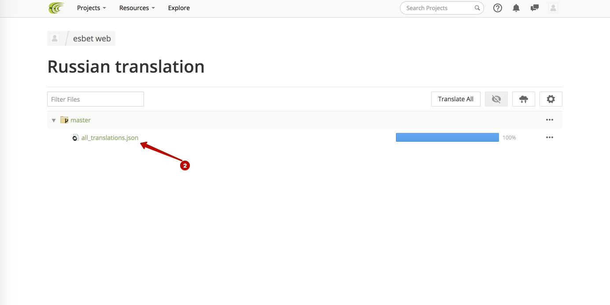
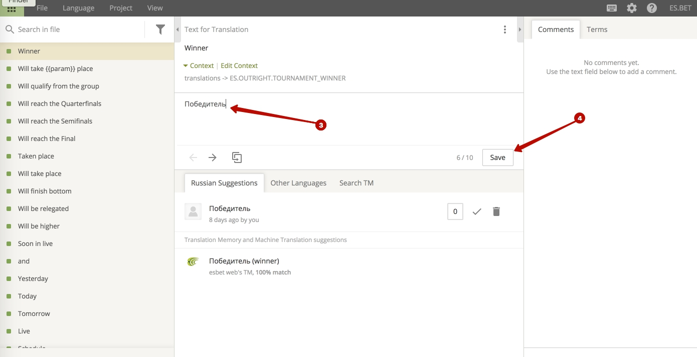
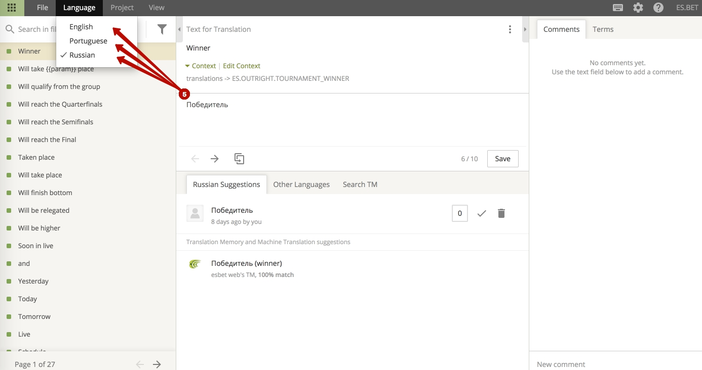
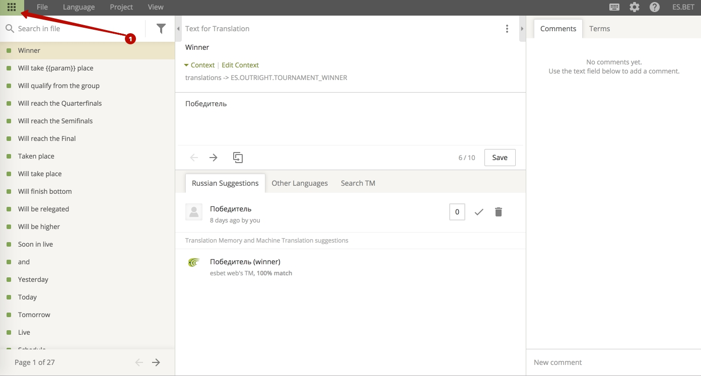
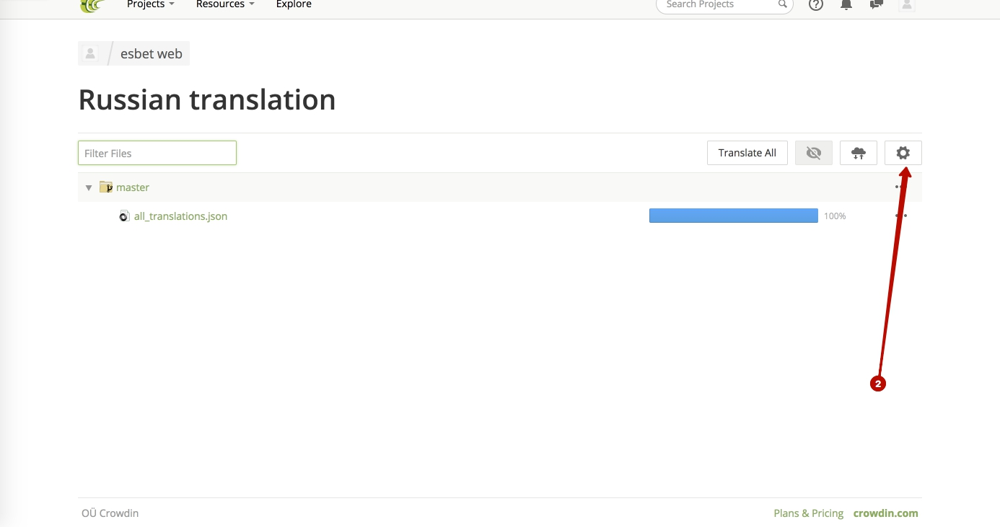
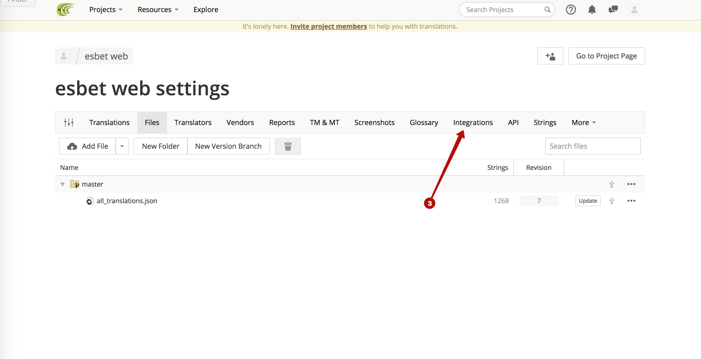
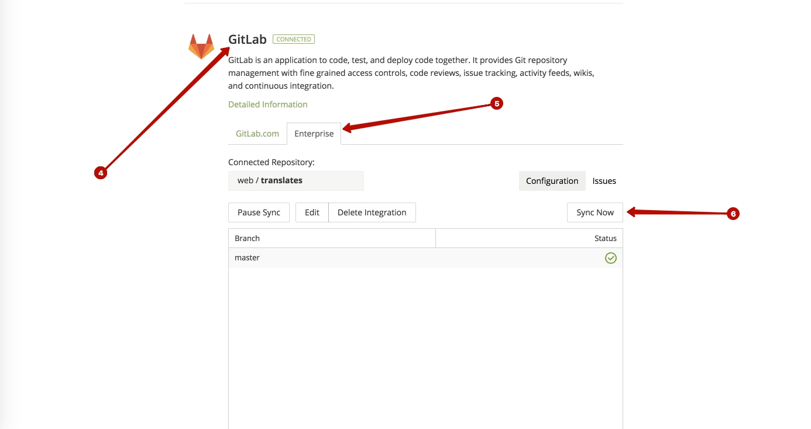

1) Login to a [crowdin](https://crowdin.com/project/esbet-web) service
2) Chose language

3) Edit translation
4) Save

5) Change language

## Sync
1) If you in a language menu - go to main menu
  
2) Go to project settings -> integrations

3) Chose Gitlab -> enterprise -> 'Sync now' button
